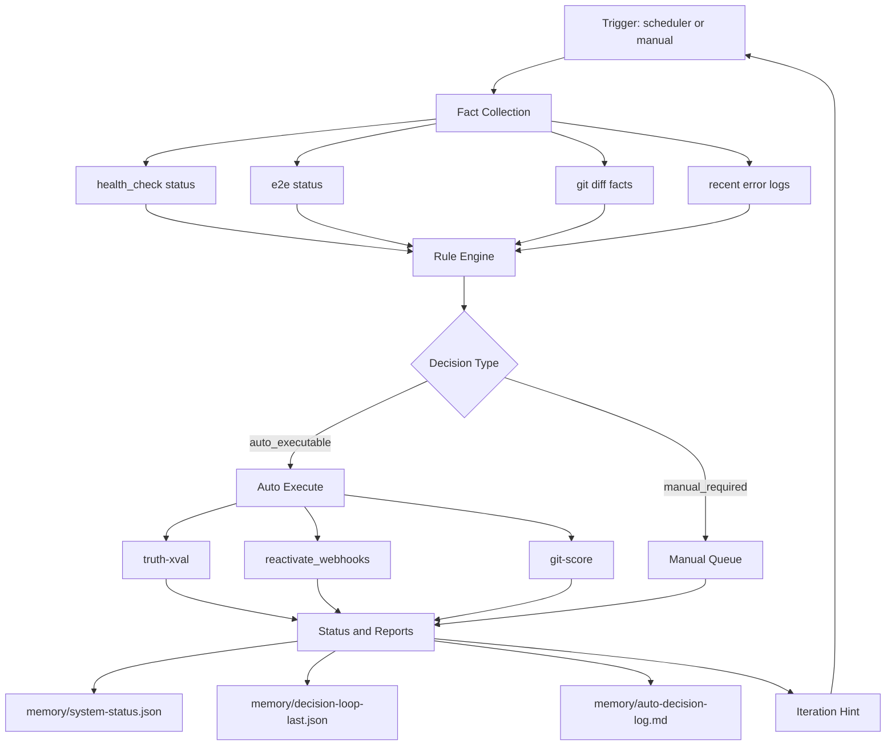

# meta-agent 專案執行程序圖（簡化版）

核心原則：
- 單一決策入口（decision-engine）
- 先事實、後決策、再執行
- 每輪都產生 machine-readable 產物，下一輪直接接續

## 執行入口

- 分析模式：`python3 scripts/decision-engine.py`
- 自動執行模式：`python3 scripts/decision-engine.py --execute`
- 每小時循環：`python3 scripts/auto-decision-loop.py`

## 迭代方式

1. 看 `decision-loop-last.json` 的 facts/decisions/executions。
2. 只修正失敗步驟，不重跑整個世界。
3. 下一輪再執行 decision-engine，確認決策數量下降。
