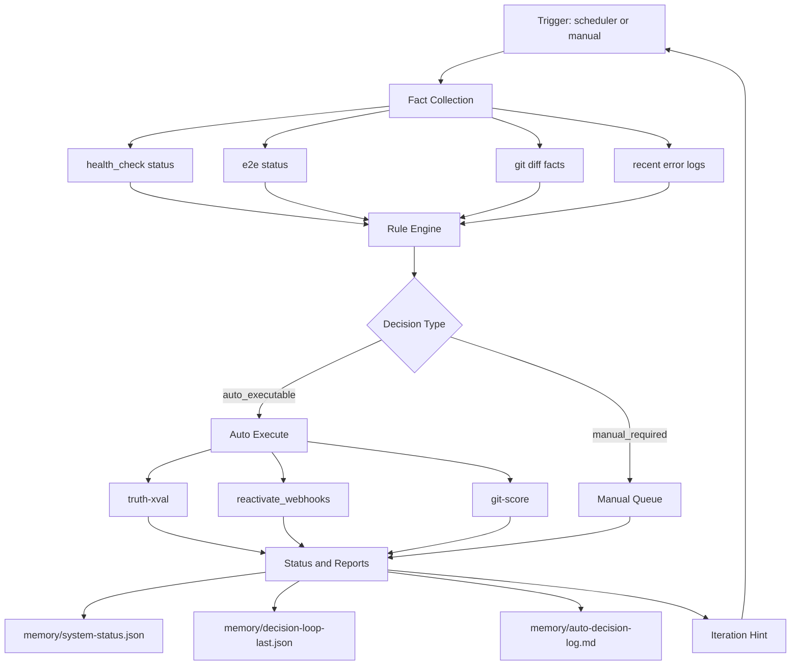
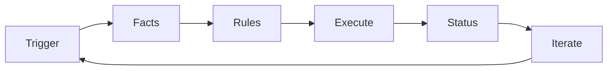
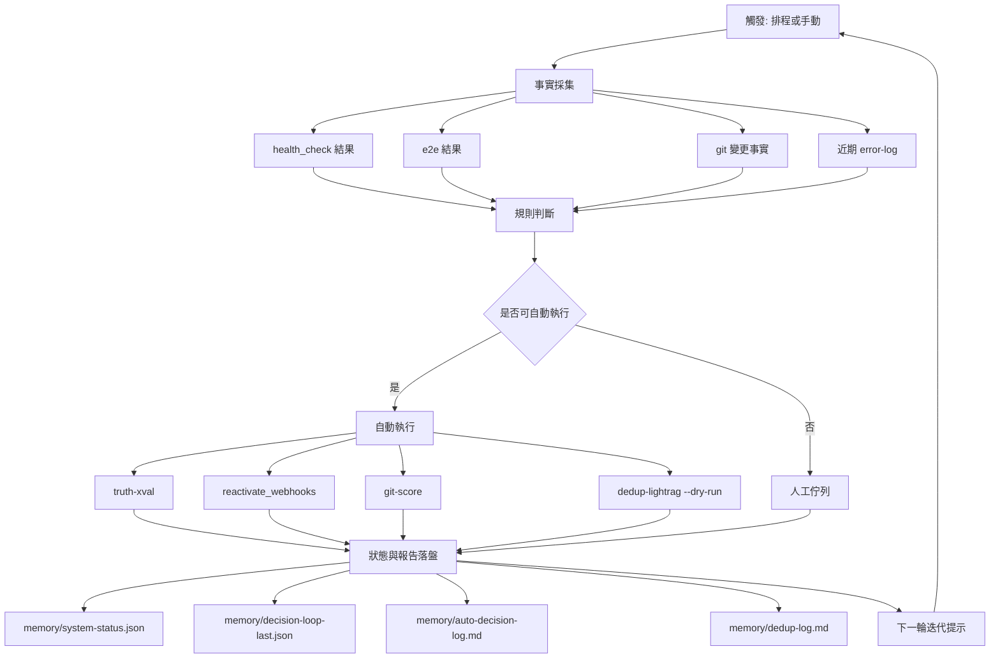

# meta-agent 專案執行程序圖（簡化版）

核心原則：
- 單一決策入口（decision-engine）
- 先事實、後決策、再執行
- 每輪都產生 machine-readable 產物，下一輪直接接續

## 執行入口

- 分析模式：`python3 scripts/decision-engine.py`
- 自動執行模式：`python3 scripts/decision-engine.py --execute`
- 每小時循環：`python3 scripts/auto-decision-loop.py`

## 迭代方式

1. 看 `decision-loop-last.json` 的 facts/decisions/executions。
2. 只修正失敗步驟，不重跑整個世界。
3. 下一輪再執行 decision-engine，確認決策數量下降。

## 管理層簡報版（6 節點）

### 簡報話術（一句版）

「系統每輪先讀事實，再套規則自動執行，最後把結果寫回狀態檔，下一輪持續迭代。」

### 管理 KPI（事實面）

1. Decision 數量是否下降（`memory/decision-loop-last.json`）
2. 自動執行成功率是否上升（`executions.ok`）
3. P0 項目平均修復輪數是否下降（由連續迭代報告計算）

## 工程版中文圖（運維與恢復）

### 工程版重點

1. 先看事實再執行，不憑主觀判斷。
2. auto 與 manual 分流，避免阻塞整體循環。
3. 每輪固定落盤，方便追蹤與回歸驗證。
