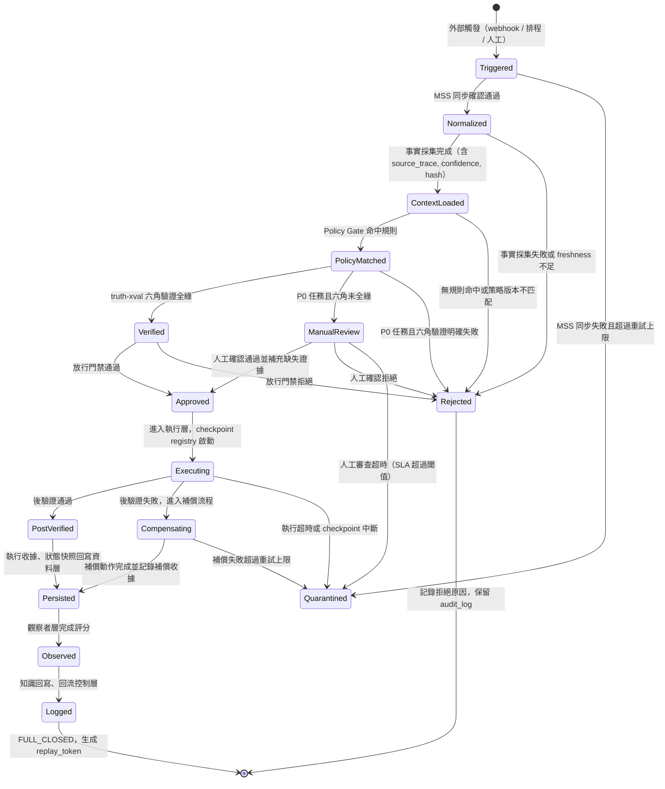
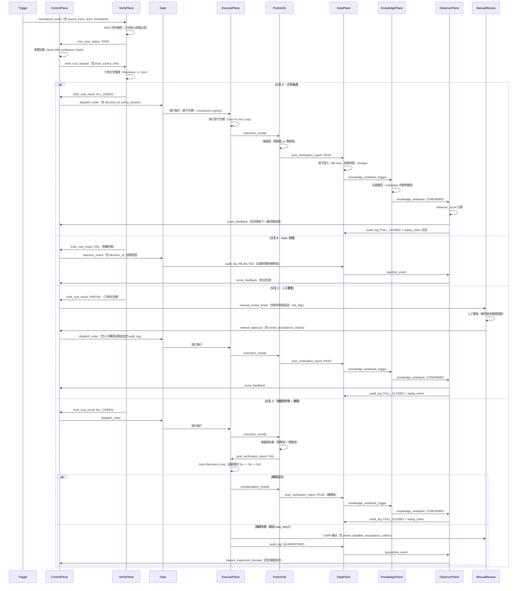

# 零信任架構：全閉環 TDD / BDD 工程規格

**狀態**：Draft v1（gen生成）
**建立日期**：2026-03-21
**適用範圍**：meta-agent 零信任全閉環系統
**文件定位**：架構憲法 / 測試總綱 / 驗收標準 / 回歸門禁

---

## 目錄

1. [核心原則](#1-核心原則)
2. [全閉環定義](#2-全閉環定義)
3. [系統狀態機](#3-系統狀態機)
4. [工程分層與責任](#4-工程分層與責任)
5. [TDD 分層規格](#5-tdd-分層規格)
6. [BDD 行為規格](#6-bdd-行為規格)
7. [全閉環時序圖](#7-全閉環時序圖)
8. [關鍵資料模型](#8-關鍵資料模型)
9. [測試目錄骨架](#9-測試目錄骨架)
10. [CI / Gate 建議](#10-ci--gate-建議)
11. [結論](#11-結論)

---

## 1. 核心原則

本系統採用零信任設計哲學，所有執行路徑皆須經過顯式驗證。以下五條原則構成系統的不可侵犯邊界，任何實作不得繞過。

### 原則一：沒有證據不准放行

任何任務在進入執行層之前，必須提供可驗證的事實憑據，包含來源鏈（source_trace）、信心分數（confidence）、時間戳（timestamp）與決策 ID（decision_id）。缺少任一欄位，放行門禁（Gate）必須拒絕，並記錄拒絕原因。系統不信任「自稱正確」的輸入，僅信任「有證據支持」的事實。

### 原則二：沒有後驗證不算成功

執行層完成原子任務後，必須觸發後驗證流程（post-verification）。後驗證須產出機器可讀的通過/失敗報告（post_verification_report），包含預期值、實際值、驗證時間與驗證方法。若後驗證缺席，該任務的執行結果不得被計算為成功，亦不得觸發後續的知識沉澱或狀態更新。

### 原則三：沒有回寫不算完成

任務執行結果（無論成功或失敗）必須回寫至資料層，產生可追溯的執行收據（execution_receipt）、狀態快照（health_snapshot）與決策記錄（audit_log）。回寫失敗視同任務未完成，系統須進入補償流程（compensation）。沒有回寫的任務，在系統視角中等同於從未發生。

### 原則四：沒有回流不算閉環

知識回寫至知識層（knowledge_writeback）後，必須觸發觀察者層（Observer Plane）的評分（observer_score），並將評分結果及任務產出回流至控制層（Control Plane），更新下一輪迭代的決策依據。閉環的定義是：任務的結果確實改變了系統的下一步判斷，而非僅是完成了一個孤立的執行動作。

### 原則五：沒有 Replay 能力不算可審計

系統的每一個閉環必須產生一個不可偽造的回放令牌（replay_token），使任何授權方可在不重新執行原始副作用的前提下，完整重現決策鏈：從觸發事件、事實收集、策略比對、執行行為、後驗證結果，到知識沉澱的全過程。無法 Replay 的執行紀錄，不具備法規級審計資格。

---

## 2. 全閉環定義

### 2.1 FULL_CLOSED 條件

一個任務被判定為 `FULL_CLOSED`，必須滿足以下所有欄位均已完整填寫且驗證通過：

```
FULL_CLOSED := {
  actor:                    String,        // 執行主體 ID（agent / human / scheduler）
  source_trace:             SourceChain,   // 完整來源鏈，含每個事實的原始路徑與 hash
  decision_id:              UUID,          // 全域唯一決策 ID，跨層追蹤用
  policy_version:           SemVer,        // 執行時套用的 law.json 版本號
  truth_source_refs:        [DocumentRef], // 至少一份真理來源文件的參照清單
  truth_xval_result:        XvalReport,    // 六角交叉驗證報告，含各角通過/失敗狀態
  health_snapshot:          HealthReport,  // 執行前後的 health probe 快照差異
  execution_receipt:        Receipt,       // 執行層的原子任務收據，含 checkpoint 紀錄
  post_verification_report: VerifyReport,  // 後驗證報告，含預期值/實際值/方法
  audit_log:                AuditEntry[],  // 完整審計日誌，時序排列，不可刪除
  knowledge_writeback:      KGEntry,       // 知識層入庫確認，含 metadata 完整率
  observer_score:           ScoreReport,   // 觀察者層評分（0.0 ~ 1.0）
  replay_token:             JWT            // 含簽章的回放令牌，有效期不少於 90 天
}
```

以上任一欄位缺失，系統不得將狀態標記為 `FULL_CLOSED`。

### 2.2 降級狀態定義

| 狀態 | 觸發條件 | 允許的後續動作 |
|------|---------|--------------|
| `REJECTED` | policy_version 缺失、source_trace 不完整、six-angle 未全綠（P0 任務） | 僅允許補齊證據後重新提交；不得直接進入執行層 |
| `PARTIAL_CLOSED` | execution_receipt 存在但 post_verification_report 缺失 | 允許補跑後驗證；補跑結果須追加至原 decision_id 紀錄 |
| `DEGRADED_CLOSED` | knowledge_writeback 失敗或 observer_score 未產生 | 允許人工補寫知識條目；須在 24 小時內完成，否則升級為 QUARANTINED |
| `QUARANTINED` | 同類錯誤 7 日內未下降，或 DEGRADED_CLOSED 超過 24 小時未修復 | 凍結相關功能擴展；強制開啟 CAPA 流程；需雙人確認方可解除 |

---

## 3. 系統狀態機

### 3.1 狀態轉移圖



### 3.2 狀態機不變式（Invariants）

以下條件在任何狀態下必須恆成立，違反任一條件系統須立即進入 `Quarantined` 並告警：

1. **決策 ID 唯一性**：同一個 `decision_id` 不得出現在兩條並行的執行路徑中。
2. **策略版本鎖定**：從 `PolicyMatched` 到 `Logged`，`policy_version` 不得變更。
3. **來源鏈完整性**：`source_trace` 中每一個節點都必須有對應的原始路徑和 hash，且 hash 必須可驗證。
4. **審計日誌不可刪除**：`audit_log` 在進入 `Executing` 後只能追加，不得修改或刪除。
5. **後驗證先於回寫**：`Persisted` 必須在 `PostVerified` 或 `Compensating` 之後，不得跳過。
6. **Replay 令牌生命週期**：`replay_token` 在 `FULL_CLOSED` 後必須立即生成，有效期不得少於 90 天。
7. **觀察者評分閾值**：`observer_score` 低於 0.7 時，下一輪同類任務必須強制進入 `ManualReview`。
8. **知識回寫元資料完整率**：`knowledge_writeback` 的 metadata 完整率必須 >= 98%，否則標記為 `DEGRADED_CLOSED`。

---

## 4. 工程分層與責任

系統共分為七個工程層，每層有明確的責任邊界、輸入輸出規格與禁止事項。跨層呼叫必須通過定義好的介面，不允許任何層直接讀寫非自身負責的資料區域。

---

### 4.1 Trigger Layer（觸發層）

**責任**：接收並正規化所有外部與內部觸發事件，確保事件進入系統前已完成基礎結構化。

**主要輸入**：
- HTTP Webhook 請求（n8n 轉發或直接呼叫）
- 排程器（launchd / cron）觸發信號
- 人工請求（CLI 指令 / 管理介面提交）

**主要輸出**：
- 正規化事件物件（normalized_event），含 event_type, actor, timestamp, raw_payload_hash
- MSS 同步觸發信號（mss_sync_request）

**禁止事項**：
- 禁止在觸發層執行任何業務邏輯或決策判斷
- 禁止在觸發層直接寫入資料層（Data Plane）
- 禁止丟棄任何觸發事件，所有事件必須進入系統記錄

---

### 4.2 Control Plane（控制層）

**責任**：執行策略比對、風險分級（P0/P1/P2）、決策協調與放行門禁判斷。

**主要輸入**：
- 正規化事件物件（來自 Trigger Layer）
- MSS 同步確認結果（來自 Verify Plane）
- 策略文件（law.json，含規則、門檻、禁區定義）
- 觀察者層回流評分（observer_score）

**主要輸出**：
- 決策記錄（decision_record），含 decision_id, risk_level, matched_rules, policy_version
- 放行指令（dispatch_order）或拒絕通知（rejection_notice）
- 人工審查票單（manual_review_ticket）

**禁止事項**：
- 禁止在未完成 MSS 同步確認的情況下發出放行指令
- 禁止跳過 truth-xval 六角驗證直接對 P0 任務放行
- 禁止修改已生成的 decision_id 或 policy_version
- 禁止直接呼叫執行層（必須通過 Gate 中介）

---

### 4.3 Verify Plane（驗證層）

**責任**：執行前置條件確認、六角交叉驗證（truth-xval）、MSS 同步狀態比對與後置條件驗證。

**主要輸入**：
- 決策記錄（來自 Control Plane）
- 真理來源參照（truth_source_refs）
- 執行收據（來自 Execute Plane，用於後驗證）
- 健康探針資料（來自 Observer Plane）

**主要輸出**：
- truth_xval_result（六角驗證報告，含每個角度的通過/失敗狀態與原因）
- post_verification_report（後驗證報告，含預期值、實際值、驗證時間）
- mss_sync_status（同步一致性確認結果）

**禁止事項**：
- 禁止在六角驗證中使用過時（freshness > 15 分鐘）的健康探針資料
- 禁止對驗證失敗的任務直接放行，即使只有一個角度失敗
- 禁止修改驗證報告中的任何欄位，驗證報告一旦產生即不可變

---

### 4.4 Execute Plane（執行層）

**責任**：執行通過放行門禁的原子任務，維護 checkpoint registry，管理自動恢復與補償流程。

**主要輸入**：
- 放行指令（來自 Control Plane Gate）
- Checkpoint 定義（來自 law.json 的執行規範）
- 自動恢復策略（retry 次數、退避時間、降級條件）

**主要輸出**：
- execution_receipt（執行收據，含每個 checkpoint 的結果、時間戳與 hash）
- 補償動作記錄（compensation_record）
- 執行狀態更新信號（發往 Data Plane）

**禁止事項**：
- 禁止在未收到有效 dispatch_order 的情況下自行啟動執行
- 禁止在一個閉環內執行多個無關的原子任務（One Fix Per Loop 原則）
- 禁止在 checkpoint 中斷後跳過補償流程直接宣告成功
- 禁止直接寫入知識層（Knowledge Plane）

---

### 4.5 Data Plane（資料層）

**責任**：以原子提交機制統一管理所有狀態 shard、事件文件、決策報告與 lineage 記錄，保障狀態一致性。

**主要輸入**：
- 執行收據（來自 Execute Plane）
- 後驗證報告（來自 Verify Plane）
- 審計日誌條目（來自各層）
- 觀察者評分（來自 Observer Plane）

**主要輸出**：
- 一致性狀態快照（health_snapshot）
- 決策報告（decision_report，machine-readable JSON）
- Lineage 記錄（lineage_entry，含完整的因果鏈追蹤）
- 知識入庫觸發信號（發往 Knowledge Plane）

**禁止事項**：
- 禁止任何層繞過 Data Plane 直接讀寫狀態 shard
- 禁止在未完成 file lock 的情況下執行狀態寫入
- 禁止刪除任何已確認的 audit_log 條目
- 禁止在 lineage 記錄中使用不可追溯的匿名來源

---

### 4.6 Knowledge Plane（知識層）

**責任**：接收標準化文件、執行去重與 TTL 管理、維護 LightRAG 知識圖譜、確保所有入庫知識的 metadata 完整率 >= 98%。

**主要輸入**：
- 知識入庫觸發信號（來自 Data Plane）
- 錯誤修復文件（error_fix documents）
- 決策與驗證文件（decision documents）
- 回歸報告（regression reports）

**主要輸出**：
- knowledge_writeback 確認（含 metadata 完整率、入庫時間戳）
- 去重結果報告（dedup_report）
- 知識可溯源索引（可供查詢層使用）

**禁止事項**：
- 禁止入庫 metadata 不完整（完整率 < 98%）的知識條目至高風險決策路徑
- 禁止在未完成去重檢查的情況下確認 knowledge_writeback
- 禁止修改已入庫的原始文件內容，修正必須以新版本文件追加方式處理

---

### 4.7 Observer Plane（觀察者層）

**責任**：執行週期性健康探針、E2E 驗證運行、KPI 計算與回流評分，並在異常時觸發系統性事件升級。

**主要輸入**：
- 系統狀態快照（來自 Data Plane）
- health probe 結果（health_check.json 等）
- E2E 測試執行結果

**主要輸出**：
- observer_score（0.0 ~ 1.0 的評分，附帶評分依據）
- health_snapshot（各服務健康狀態的機器可讀快照）
- KPI 更新（MSS 通過率、drift 率、MTTR、假陽性率、覆蓋率）
- 回流評分信號（發往 Control Plane）
- 系統性事件告警（當同類失敗 7 日未下降時觸發）

**禁止事項**：
- 禁止使用超過 15 分鐘的過時健康資料作為放行依據
- 禁止在未產生 machine-readable 報告的情況下宣告 E2E 通過
- 禁止抑制或丟棄系統性事件告警

---

## 5. TDD 分層規格

本系統採用六層 TDD 框架（L0~L5），從最基礎的不變式驗證到最高層的混沌與漂移測試。每一層的測試都必須在下一層測試執行之前達到 100% 通過率。

---

### L0 Invariant Tests（不變式測試）

**目標**：驗證系統的不可侵犯邊界在任何條件下均成立。

| 測試 ID | 測試名稱 | 驗證條件 |
|---------|---------|---------|
| TDD-L0-001 | decision_id_uniqueness | 同一 decision_id 不得出現在兩個並行執行路徑中 |
| TDD-L0-002 | policy_version_lock | 從 PolicyMatched 到 Logged，policy_version 不得變更 |
| TDD-L0-003 | source_trace_completeness | source_trace 中每個節點必須有可驗證的 hash |
| TDD-L0-004 | audit_log_immutability | Executing 後的 audit_log 不得被修改或刪除 |
| TDD-L0-005 | post_verify_before_persist | Persisted 狀態必須在 PostVerified 或 Compensating 之後 |
| TDD-L0-006 | replay_token_generation | FULL_CLOSED 後必須立即生成 replay_token |
| TDD-L0-007 | replay_token_validity | replay_token 有效期不得少於 90 天 |
| TDD-L0-008 | observer_score_threshold | observer_score < 0.7 時下一輪同類任務必須進入 ManualReview |
| TDD-L0-009 | knowledge_metadata_completeness | knowledge_writeback 的 metadata 完整率必須 >= 98% |
| TDD-L0-010 | no_bypass_gate | Execute Plane 在沒有有效 dispatch_order 的情況下不得啟動執行 |

---

### L1 Component Contract Tests（組件契約測試）

**目標**：驗證每個工程層的輸入輸出符合定義的契約規格。

| 測試 ID | 測試名稱 | 驗證條件 |
|---------|---------|---------|
| TDD-L1-011 | trigger_normalization_schema | normalized_event 必須包含 event_type, actor, timestamp, raw_payload_hash |
| TDD-L1-012 | trigger_no_business_logic | Trigger Layer 不得執行任何策略比對或風險分級 |
| TDD-L1-013 | control_plane_mss_dependency | Control Plane 在 MSS 同步確認前不得發出 dispatch_order |
| TDD-L1-014 | policy_engine_rule_match | Policy Engine 對每個 P0 任務必須產出明確的 matched_rules 清單 |
| TDD-L1-015 | verify_plane_freshness_gate | truth-xval 拒絕接受超過 15 分鐘的健康資料 |
| TDD-L1-016 | six_angle_all_green_p0 | P0 任務的六角驗證必須全部通過，單角失敗即拒絕 |
| TDD-L1-017 | execute_plane_atomic_receipt | 每個原子任務完成後必須產生 execution_receipt |
| TDD-L1-018 | execute_plane_one_fix_per_loop | 單個閉環內不得同時執行兩個無關的原子任務 |
| TDD-L1-019 | data_plane_atomic_write | 狀態寫入必須在 file lock 下執行，不得有並發衝突 |
| TDD-L1-020 | data_plane_lineage_traceability | lineage_entry 必須包含可追溯的因果鏈，不得有匿名來源 |
| TDD-L1-021 | knowledge_plane_dedup_before_confirm | knowledge_writeback 確認前必須完成去重檢查 |
| TDD-L1-022 | knowledge_plane_no_modify_original | 已入庫文件只能以新版本追加，不得直接修改原始內容 |
| TDD-L1-023 | observer_plane_machine_readable | E2E 測試結果必須輸出 machine-readable JSON 報告 |
| TDD-L1-024 | observer_plane_score_with_evidence | observer_score 必須附帶評分依據，不得是無根據的數值 |
| TDD-L1-025 | observer_plane_systemic_alert | 同類失敗 7 日未下降時必須觸發系統性事件告警 |

---

### L2 Workflow Orchestration Tests（工作流程編排測試）

**目標**：驗證跨層工作流程的正確編排順序與狀態轉移行為。

| 測試 ID | 測試名稱 | 驗證條件 |
|---------|---------|---------|
| TDD-L2-026 | happy_path_full_closure | 完整正常流程產生 FULL_CLOSED 狀態，所有必填欄位齊全 |
| TDD-L2-027 | mss_fail_blocks_trigger | MSS 同步失敗導致 Triggered 轉為 Quarantined（超過重試上限） |
| TDD-L2-028 | freshness_fail_blocks_context | 健康資料過時導致 Normalized 轉為 Rejected |
| TDD-L2-029 | policy_no_match_rejects | 無規則命中導致 ContextLoaded 轉為 Rejected |
| TDD-L2-030 | p0_xval_partial_fail_routes_to_manual | P0 任務六角驗證未全綠路由至 ManualReview |
| TDD-L2-031 | p0_xval_explicit_fail_rejects | P0 任務六角驗證明確失敗路由至 Rejected |
| TDD-L2-032 | gate_pass_routes_to_executing | 放行門禁通過正確進入 Executing 狀態 |
| TDD-L2-033 | post_verify_pass_routes_to_persisted | 後驗證通過正確進入 Persisted 狀態 |
| TDD-L2-034 | post_verify_fail_routes_to_compensating | 後驗證失敗正確進入 Compensating 狀態 |
| TDD-L2-035 | compensation_success_routes_to_persisted | 補償成功正確進入 Persisted 狀態 |
| TDD-L2-036 | compensation_fail_routes_to_quarantined | 補償失敗超過重試上限進入 Quarantined |
| TDD-L2-037 | persisted_routes_to_observed | Persisted 後觸發觀察者層評分 |
| TDD-L2-038 | observed_routes_to_logged | 評分完成後觸發知識回寫與控制層回流 |
| TDD-L2-039 | logged_produces_replay_token | Logged 完成後生成有效的 replay_token |
| TDD-L2-040 | manual_review_timeout_quarantines | ManualReview 超過 SLA 閾值進入 Quarantined |

---

### L3 Post-Execution / Compensation Tests（後執行與補償測試）

**目標**：驗證後驗證失敗場景下的補償流程完整性與邊界行為。

| 測試 ID | 測試名稱 | 驗證條件 |
|---------|---------|---------|
| TDD-L3-041 | compensation_receipt_generated | 補償動作必須產生 compensation_record |
| TDD-L3-042 | compensation_appended_to_original_receipt | compensation_record 必須附加至原始 execution_receipt |
| TDD-L3-043 | retry_backoff_schedule | 重試必須遵循退避排程（1m -> 3m -> 5m），不得立即重試 |
| TDD-L3-044 | max_retry_enforced | 超過 max_retry 後必須降級至人工，不得繼續自動重試 |
| TDD-L3-045 | partial_closed_state_on_missing_post_verify | execution_receipt 存在但 post_verification_report 缺失時狀態為 PARTIAL_CLOSED |
| TDD-L3-046 | partial_closed_allows_supplementary_verify | PARTIAL_CLOSED 狀態允許補跑後驗證並追加結果 |
| TDD-L3-047 | supplementary_verify_appended_to_decision_id | 補跑後驗證結果必須追加至原 decision_id 紀錄，不得建立新記錄 |
| TDD-L3-048 | compensation_for_data_plane_write_failure | Data Plane 寫入失敗必須觸發補償流程 |
| TDD-L3-049 | compensation_for_knowledge_writeback_failure | knowledge_writeback 失敗狀態為 DEGRADED_CLOSED |
| TDD-L3-050 | degraded_closed_sla_enforcement | DEGRADED_CLOSED 超過 24 小時自動升級為 QUARANTINED |
| TDD-L3-051 | quarantine_blocks_feature_expansion | QUARANTINED 狀態必須凍結相關功能擴展 |
| TDD-L3-052 | quarantine_requires_dual_approval | QUARANTINED 解除必須有雙人確認記錄 |
| TDD-L3-053 | capa_item_mandatory_fields | CAPA 條目必須包含 owner, deadline, acceptance_criteria |
| TDD-L3-054 | capa_dual_verification | CAPA 結案前必須完成立即驗證與延遲回歸驗證兩次 |
| TDD-L3-055 | systemic_incident_triggers_pause | 同類失敗 7 日未下降必須暫停相關功能擴展並升級為系統性事件 |

---

### L4 Knowledge / Replay Tests（知識與回放測試）

**目標**：驗證知識入庫品質、去重機制與 Replay 能力的完整性。

| 測試 ID | 測試名稱 | 驗證條件 |
|---------|---------|---------|
| TDD-L4-056 | knowledge_metadata_all_required_fields | 每份知識文件必須包含 doc_type, origin_path, occurred_at, indexed_at, confidence, validity, tags, lineage |
| TDD-L4-057 | knowledge_confidence_score_present | knowledge 條目必須有 confidence 分數，不得為 null |
| TDD-L4-058 | knowledge_lineage_traceable | 每份知識文件的 lineage 必須可追溯至原始事件或決策 |
| TDD-L4-059 | dedup_string_similarity_check | 字串相似度超過閾值的條目必須標記為重複並排除入庫 |
| TDD-L4-060 | dedup_report_generated | 每次 dedup 執行必須產生 dedup_report |
| TDD-L4-061 | ttl_gc_removes_expired | 超過 TTL 的知識條目必須被 GC 移除 |
| TDD-L4-062 | high_risk_query_blocks_incomplete_metadata | metadata 完整率 < 98% 的知識不得用於高風險決策 |
| TDD-L4-063 | replay_token_signed | replay_token 必須包含有效的 JWT 簽章 |
| TDD-L4-064 | replay_reconstructs_full_decision_chain | 使用 replay_token 可完整重現：觸發事件、事實收集、策略比對、執行行為、後驗證結果、知識沉澱 |
| TDD-L4-065 | replay_no_side_effects | Replay 執行不得觸發實際的副作用（寫入生產系統） |
| TDD-L4-066 | replay_token_expiry_enforced | 超過有效期的 replay_token 必須被拒絕 |
| TDD-L4-067 | knowledge_writeback_triggers_observer_score | knowledge_writeback 完成後必須觸發 observer_score 計算 |
| TDD-L4-068 | observer_score_feeds_back_to_control | observer_score 必須回流至 Control Plane 並更新下一輪決策依據 |
| TDD-L4-069 | knowledge_version_append_not_modify | 知識修正必須以新版本追加，原始版本必須保留 |
| TDD-L4-070 | all_queries_traceable_to_source | 任何知識查詢結果必須可回溯至原始來源檔與 decision_id |

---

### L5 Chaos / Drift / Resilience Tests（混沌、漂移與韌性測試）

**目標**：在注入故障、時鐘漂移、網路分斷等異常條件下驗證系統的韌性與自恢復能力。

| 測試 ID | 測試名稱 | 驗證條件 |
|---------|---------|---------|
| TDD-L5-071 | data_plane_write_failure_recovery | Data Plane 寫入失敗後系統必須自動進入補償流程 |
| TDD-L5-072 | knowledge_plane_unavailable_degraded | Knowledge Plane 不可用時系統降級為 DEGRADED_CLOSED 而非崩潰 |
| TDD-L5-073 | lightrag_timeout_handled | LightRAG 連線逾時必須被捕獲並觸發降級機制 |
| TDD-L5-074 | mss_sync_partial_failure | MSS 三份核心狀態中兩份不一致時系統正確標記 sync_drift |
| TDD-L5-075 | clock_drift_detected | 系統時間漂移超過閾值時健康探針必須標記為 stale |
| TDD-L5-076 | concurrent_write_prevented | 並發的狀態寫入請求必須序列化，不得產生競爭條件 |
| TDD-L5-077 | checkpoint_resume_after_crash | 執行層崩潰後重啟必須從最後一個有效 checkpoint 繼續 |
| TDD-L5-078 | network_partition_isolates_gracefully | 網路分斷時系統必須停止執行並等待連線恢復，不得推測性執行 |
| TDD-L5-079 | policy_drift_detected | law.json 版本變更必須被偵測並記錄，進行中的任務不得受影響 |
| TDD-L5-080 | repeated_failure_triggers_systemic_check | 同根因失敗在 14 天內再次發生時自動觸發系統性檢查 |
| TDD-L5-081 | false_positive_rate_within_threshold | P0 假陽性率必須維持在 < 2%（7 日滾動窗口） |
| TDD-L5-082 | mttr_within_sla | P0 故障的平均恢復時間（MTTR）必須 <= 15 分鐘 |
| TDD-L5-083 | auto_recovery_success_rate | 自動恢復成功率必須 >= 95%（7 日滾動窗口） |
| TDD-L5-084 | sync_drift_rate_within_threshold | Sync drift 率必須維持在 < 3%（7 日滾動窗口） |
| TDD-L5-085 | failure_trend_slope_decreasing | 同類失敗事件的 7 日趨勢斜率必須 < 0（持續下降） |

---

## 6. BDD 行為規格

本節使用 Gherkin 格式定義系統的行為規格，作為驗收測試（Acceptance Test）的基礎。每個 Feature 對應一個核心行為邊界，所有 Scenario 必須在 CI 中可執行。

---

### Feature: 零信任執行門禁

```gherkin
Feature: 零信任執行門禁
  作為系統控制層
  為了保障每個執行動作都有可信的事實基礎
  必須在沒有完整來源鏈的情況下拒絕任何放行請求

  Scenario: source_trace 缺失時拒絕放行
    Given 系統收到一個觸發事件
    And 事件的 source_trace 欄位為空
    When Control Plane 評估放行條件
    Then 系統必須回應 REJECTED 狀態
    And rejection_notice 必須記錄原因為 "source_trace_missing"
    And audit_log 必須包含此次拒絕的完整紀錄

  Scenario: policy_version 不匹配時拒絕放行
    Given 系統收到一個觸發事件
    And 事件攜帶的 policy_version 與當前 law.json 版本不符
    When Control Plane 評估放行條件
    Then 系統必須回應 REJECTED 狀態
    And rejection_notice 必須記錄原因為 "policy_version_mismatch"

  Scenario: 所有條件滿足時允許放行
    Given 系統收到一個觸發事件
    And source_trace 完整且所有 hash 可驗證
    And policy_version 與當前 law.json 版本一致
    And MSS 同步確認通過
    When Control Plane 評估放行條件
    Then 系統必須產生有效的 dispatch_order
    And decision_id 必須唯一且已記錄於 audit_log
```

---

### Feature: 真理來源衝突處理

```gherkin
Feature: 真理來源衝突處理
  作為驗證層
  為了避免矛盾的事實進入執行層
  當不同真理來源的數據產生衝突時必須阻斷執行並要求人工確認

  Scenario: 兩個真理來源數據矛盾
    Given 驗證層收到兩份真理來源文件
    And 文件 A 的 confidence 為 0.9，顯示服務狀態為 "healthy"
    And 文件 B 的 confidence 為 0.85，顯示服務狀態為 "degraded"
    When 六角驗證執行衝突比對
    Then truth_xval_result 必須標記衝突角度為 "CONFLICT"
    And 對應的 P0 任務必須路由至 ManualReview
    And manual_review_ticket 必須包含兩份文件的參照與衝突描述

  Scenario: 真理來源時效性不足
    Given 驗證層收到一份真理來源文件
    And 文件的最後更新時間距今超過 15 分鐘
    When 六角驗證執行時效性檢查
    Then truth_xval_result 必須標記該角度為 "STALE"
    And 對應任務必須進入 pending_refresh 狀態
```

---

### Feature: 健康感知零信任門禁

```gherkin
Feature: 健康感知零信任門禁
  作為系統
  為了避免在依賴服務不健康時執行高風險任務
  必須在健康探針資料過時或顯示異常時阻擋 P0 任務

  Scenario: 健康探針資料過時時阻擋 P0 任務
    Given Observer Plane 最後一次 health probe 時間為 20 分鐘前
    And 系統收到一個 P0 等級的執行請求
    When Verify Plane 檢查健康探針時效性
    Then 系統必須標記 input_stale
    And 系統必須阻擋此次 P0 任務執行
    And 系統必須建立 refresh_ticket 並等待健康資料刷新

  Scenario: 健康探針顯示關鍵依賴不可用
    Given 最新 health probe 顯示 LightRAG 服務狀態為 "unavailable"
    And 系統收到一個需要 LightRAG 的 P0 任務
    When Control Plane 評估放行條件
    Then 系統必須拒絕放行並路由至 ManualReview
    And rejection_notice 必須記錄原因為 "dependency_unavailable: LightRAG"
```

---

### Feature: 後置執行驗證

```gherkin
Feature: 後置執行驗證
  作為系統
  為了確認執行動作確實達到預期效果
  每個原子任務完成後必須執行獨立的後置驗證

  Scenario: 後驗證通過完整閉環
    Given Execute Plane 完成一個原子任務
    And execution_receipt 已生成
    When Verify Plane 執行後置驗證
    Then post_verification_report 必須包含預期值、實際值、驗證時間
    And 預期值與實際值一致
    And 系統必須轉移至 PostVerified 狀態
    And 後續觸發 Persisted 流程

  Scenario: 後驗證失敗觸發補償
    Given Execute Plane 完成一個原子任務
    And execution_receipt 已生成
    When Verify Plane 執行後置驗證
    And 實際值與預期值不符
    Then post_verification_report 必須記錄失敗原因
    And 系統必須轉移至 Compensating 狀態
    And Auto-Recovery Loop 必須依照退避排程執行重試
```

---

### Feature: 部分成功補償

```gherkin
Feature: 部分成功補償
  作為系統
  為了在部分步驟失敗時保持系統一致性
  必須對未完成的步驟執行補償動作並記錄補償結果

  Scenario: 執行中斷後補償並記錄
    Given Execute Plane 在 checkpoint 3 of 5 時發生中斷
    And 前 2 個 checkpoint 已完成並有 execution_receipt 記錄
    When Auto-Recovery Loop 啟動補償
    Then 系統必須從 checkpoint 3 繼續執行
    And compensation_record 必須附加至原始 execution_receipt
    And 所有補償步驟必須在 audit_log 中有獨立的時序紀錄

  Scenario: 補償超過重試上限進入 Quarantined
    Given Compensating 狀態下已執行 max_retry 次補償
    And 所有補償均失敗
    When 系統判斷補償無法自動恢復
    Then 系統必須轉移至 Quarantined 狀態
    And 必須建立 CAPA 條目，包含 owner, deadline, acceptance_criteria
    And 相關功能擴展必須被凍結
```

---

### Feature: 知識與審計回寫

```gherkin
Feature: 知識與審計回寫
  作為系統
  為了讓每次執行結果都能成為未來決策的知識基礎
  每個閉環完成後必須將執行結果寫入知識層並確認 metadata 完整

  Scenario: 成功閉環觸發知識回寫
    Given 系統達到 PostVerified 狀態
    When Data Plane 觸發知識入庫流程
    Then knowledge_writeback 必須包含完整的 metadata（doc_type, origin_path, occurred_at, indexed_at, confidence, validity, tags, lineage）
    And metadata 完整率必須 >= 98%
    And knowledge_writeback 確認後必須觸發 observer_score 計算

  Scenario: metadata 不完整時拒絕高風險知識使用
    Given 一份知識文件的 metadata 完整率為 95%
    When 高風險決策查詢此知識文件
    Then 系統必須拒絕此次查詢
    And 回傳錯誤原因為 "knowledge_metadata_incomplete"
    And 自動建立 CAPA 條目要求補齊 metadata
```

---

### Feature: 人工審查閉環

```gherkin
Feature: 人工審查閉環
  作為系統
  為了在六角驗證未全綠或高風險任務需要人工確認時保持閉環
  必須提供完整的人工審查流程並在確認後繼續自動化流程

  Scenario: P0 任務六角未全綠路由至人工審查
    Given 系統收到 P0 等級的任務
    And 六角驗證中有 1 個角度為黃燈（未全綠）
    When Control Plane 評估放行條件
    Then 系統必須路由至 ManualReview 狀態
    And manual_review_ticket 必須包含缺失的驗證角度描述
    And 系統必須保留風險標記（risk_flag）

  Scenario: 人工審查通過後繼續自動化流程
    Given 系統處於 ManualReview 狀態
    And 人工審查人員補充了缺失的驗證證據
    When 人工提交確認（含 owner 與 acceptance_criteria）
    Then 系統必須轉移至 Approved 狀態
    And 人工確認紀錄必須追加至原 decision_id 的 audit_log
    And 後續自動化流程必須正常繼續

  Scenario: 人工審查超時進入 Quarantined
    Given 系統處於 ManualReview 狀態
    And 距離 manual_review_ticket 建立已超過 SLA 閾值
    When Observer Plane 偵測到審查超時
    Then 系統必須轉移至 Quarantined 狀態
    And 必須發送告警通知至系統管理員
```

---

### Feature: 可回放閉環

```gherkin
Feature: 可回放閉環
  作為審計人員
  為了能在不重新執行原始副作用的前提下驗證歷史決策的正確性
  每個 FULL_CLOSED 閉環必須產生可驗證的 replay_token

  Scenario: FULL_CLOSED 後生成 replay_token
    Given 系統達到 FULL_CLOSED 狀態
    When Logged 階段完成知識回寫與控制層回流
    Then 系統必須立即生成 replay_token
    And replay_token 必須是有效的 JWT 格式並包含 decision_id
    And replay_token 有效期必須不少於 90 天

  Scenario: 使用 replay_token 重現完整決策鏈
    Given 一個有效的 replay_token
    When 審計人員提交 replay 請求
    Then 系統必須重現：觸發事件、事實收集、策略比對、執行行為、後驗證結果、知識沉澱
    And replay 執行不得觸發任何實際副作用
    And replay 結果必須與原始 audit_log 完全一致

  Scenario: 過期 replay_token 被拒絕
    Given 一個已超過有效期的 replay_token
    When 審計人員提交 replay 請求
    Then 系統必須拒絕此請求
    And 回傳錯誤原因為 "replay_token_expired"
```

---

### Feature: 觀察者回流閉環

```gherkin
Feature: 觀察者回流閉環
  作為系統
  為了讓每次閉環的結果能影響下一輪的決策品質
  Observer Plane 的評分必須回流至 Control Plane 並更新決策依據

  Scenario: observer_score 低於閾值觸發下一輪 ManualReview
    Given 系統完成一個閉環，observer_score 為 0.65
    When Observer Plane 將評分回流至 Control Plane
    Then Control Plane 必須記錄此評分並更新下一輪同類任務的路由規則
    And 下一輪同類任務必須強制路由至 ManualReview
    And 路由原因必須記錄為 "observer_score_below_threshold: 0.65"

  Scenario: KPI 超出閾值觸發系統性事件
    Given Observer Plane 計算出 7 日滾動窗口的同類失敗趨勢斜率 >= 0
    When KPI 更新完成
    Then 系統必須觸發系統性事件告警
    And 相關功能擴展必須暫停
    And 必須建立系統性事件 CAPA 條目
```

---

## 7. 全閉環時序圖

以下時序圖展示系統各主要組件之間的完整互動順序，涵蓋正常通過、拒絕、人工審查與後驗證失敗加補償四個分支。



---

## 8. 關鍵資料模型

### 8.1 TaskRecord

```json
{
  "task_record": {
    "decision_id": "550e8400-e29b-41d4-a716-446655440000",
    "actor": "scheduler/daily-health-loop",
    "event_type": "health_check_triggered",
    "timestamp": "2026-03-21T08:00:00Z",
    "policy_version": "2.4.1",
    "risk_level": "P0",
    "source_trace": [
      {
        "node": "memory/status/health_check.json",
        "hash": "sha256:a1b2c3d4e5f6...",
        "fetched_at": "2026-03-21T07:59:45Z",
        "confidence": 0.95
      },
      {
        "node": "memory/handoff/latest-handoff.md",
        "hash": "sha256:f6e5d4c3b2a1...",
        "fetched_at": "2026-03-21T07:59:46Z",
        "confidence": 0.92
      }
    ],
    "matched_rules": [
      "rule_id: ZT-001",
      "rule_id: ZT-007"
    ],
    "status": "FULL_CLOSED",
    "created_at": "2026-03-21T08:00:00Z",
    "closed_at": "2026-03-21T08:04:32Z"
  }
}
```

### 8.2 EvidenceBundle

```json
{
  "evidence_bundle": {
    "decision_id": "550e8400-e29b-41d4-a716-446655440000",
    "truth_source_refs": [
      {
        "doc_id": "ts-2026-03-16-auto-git-score",
        "doc_type": "decision",
        "path": "truth-source/2026-03-16-auto-git-score.md",
        "confidence": 0.91,
        "validity": "active"
      }
    ],
    "truth_xval_result": {
      "overall": "ALL_GREEN",
      "angles": {
        "health_probe": "PASS",
        "decision_loop": "PASS",
        "truth_source": "PASS",
        "error_log": "PASS",
        "sync_consistency": "PASS",
        "lineage_trace": "PASS"
      },
      "verified_at": "2026-03-21T08:00:15Z"
    },
    "health_snapshot": {
      "before_execution": {
        "lightrag": "healthy",
        "n8n": "healthy",
        "memory_mcp": "healthy",
        "captured_at": "2026-03-21T07:59:50Z"
      },
      "after_execution": {
        "lightrag": "healthy",
        "n8n": "healthy",
        "memory_mcp": "healthy",
        "captured_at": "2026-03-21T08:04:20Z"
      }
    },
    "execution_receipt": {
      "checkpoints": [
        {"id": 1, "name": "fact_collection", "status": "PASS", "completed_at": "2026-03-21T08:00:30Z"},
        {"id": 2, "name": "policy_match", "status": "PASS", "completed_at": "2026-03-21T08:00:45Z"},
        {"id": 3, "name": "atomic_action", "status": "PASS", "completed_at": "2026-03-21T08:03:10Z"}
      ],
      "receipt_hash": "sha256:9f8e7d6c5b4a..."
    },
    "post_verification_report": {
      "method": "e2e_runner",
      "expected": {"sync_drift_rate": "<0.03", "health_status": "all_green"},
      "actual": {"sync_drift_rate": "0.008", "health_status": "all_green"},
      "result": "PASS",
      "verified_at": "2026-03-21T08:04:10Z"
    }
  }
}
```

### 8.3 ClosureRecord

```json
{
  "closure_record": {
    "decision_id": "550e8400-e29b-41d4-a716-446655440000",
    "closure_status": "FULL_CLOSED",
    "knowledge_writeback": {
      "doc_type": "health_event",
      "origin_path": "memory/status/health_check.json",
      "occurred_at": "2026-03-21T08:00:00Z",
      "indexed_at": "2026-03-21T08:04:25Z",
      "confidence": 0.93,
      "validity": "active",
      "tags": ["health", "zero-trust", "auto-closure"],
      "lineage": "decision_id:550e8400-e29b-41d4-a716-446655440000",
      "metadata_completeness": 1.0
    },
    "observer_score": {
      "score": 0.94,
      "evidence": {
        "post_verify_pass": true,
        "compensation_required": false,
        "manual_review_required": false,
        "knowledge_writeback_complete": true,
        "metadata_completeness": 1.0
      },
      "scored_at": "2026-03-21T08:04:28Z"
    },
    "audit_log": [
      {"event": "TRIGGERED", "at": "2026-03-21T08:00:00Z"},
      {"event": "MSS_SYNC_PASS", "at": "2026-03-21T08:00:05Z"},
      {"event": "XVAL_ALL_GREEN", "at": "2026-03-21T08:00:15Z"},
      {"event": "GATE_APPROVED", "at": "2026-03-21T08:00:20Z"},
      {"event": "EXECUTING", "at": "2026-03-21T08:00:30Z"},
      {"event": "POST_VERIFIED_PASS", "at": "2026-03-21T08:04:10Z"},
      {"event": "PERSISTED", "at": "2026-03-21T08:04:25Z"},
      {"event": "OBSERVED", "at": "2026-03-21T08:04:28Z"},
      {"event": "FULL_CLOSED", "at": "2026-03-21T08:04:32Z"}
    ],
    "replay_token": "eyJhbGciOiJIUzI1NiIsInR5cCI6IkpXVCJ9.eyJkZWNpc2lvbl9pZCI6IjU1MGU4NDAwLWUyOWItNDFkNC1hNzE2LTQ0NjY1NTQ0MDAwMCIsImV4cCI6MTc3NjA5MjI3Mn0.signature",
    "replay_token_expires_at": "2026-12-19T08:04:32Z"
  }
}
```

---

## 9. 測試目錄骨架

以下為推薦的測試目錄結構，確保各層測試的職責清晰且易於 CI 整合：

```
tests/
├── invariants/                          # L0 不變式測試
│   ├── test_decision_id_uniqueness.py   # TDD-L0-001
│   ├── test_policy_version_lock.py      # TDD-L0-002
│   ├── test_source_trace_completeness.py # TDD-L0-003
│   ├── test_audit_log_immutability.py   # TDD-L0-004
│   ├── test_post_verify_before_persist.py # TDD-L0-005
│   ├── test_replay_token_generation.py  # TDD-L0-006
│   ├── test_replay_token_validity.py    # TDD-L0-007
│   ├── test_observer_score_threshold.py # TDD-L0-008
│   ├── test_knowledge_metadata_completeness.py # TDD-L0-009
│   └── test_no_bypass_gate.py           # TDD-L0-010
│
├── contracts/                           # L1 組件契約測試
│   ├── trigger/
│   │   ├── test_normalization_schema.py # TDD-L1-011
│   │   └── test_no_business_logic.py    # TDD-L1-012
│   ├── control_plane/
│   │   ├── test_mss_dependency.py       # TDD-L1-013
│   │   └── test_policy_engine_rule_match.py # TDD-L1-014
│   ├── verify_plane/
│   │   ├── test_freshness_gate.py       # TDD-L1-015
│   │   └── test_six_angle_all_green.py  # TDD-L1-016
│   ├── execute_plane/
│   │   ├── test_atomic_receipt.py       # TDD-L1-017
│   │   └── test_one_fix_per_loop.py     # TDD-L1-018
│   ├── data_plane/
│   │   ├── test_atomic_write.py         # TDD-L1-019
│   │   └── test_lineage_traceability.py # TDD-L1-020
│   ├── knowledge_plane/
│   │   ├── test_dedup_before_confirm.py # TDD-L1-021
│   │   └── test_no_modify_original.py   # TDD-L1-022
│   └── observer_plane/
│       ├── test_machine_readable.py     # TDD-L1-023
│       ├── test_score_with_evidence.py  # TDD-L1-024
│       └── test_systemic_alert.py       # TDD-L1-025
│
├── workflows/                           # L2 工作流程編排測試
│   ├── test_happy_path_full_closure.py  # TDD-L2-026
│   ├── test_mss_fail_quarantine.py      # TDD-L2-027
│   ├── test_freshness_fail_reject.py    # TDD-L2-028
│   ├── test_policy_no_match_reject.py   # TDD-L2-029
│   ├── test_p0_xval_partial_manual.py   # TDD-L2-030
│   ├── test_p0_xval_fail_reject.py      # TDD-L2-031
│   ├── test_gate_pass_executing.py      # TDD-L2-032
│   ├── test_post_verify_pass_persisted.py # TDD-L2-033
│   ├── test_post_verify_fail_compensating.py # TDD-L2-034
│   ├── test_compensation_success.py     # TDD-L2-035
│   ├── test_compensation_fail_quarantine.py # TDD-L2-036
│   ├── test_persisted_observed.py       # TDD-L2-037
│   ├── test_observed_logged.py          # TDD-L2-038
│   ├── test_logged_replay_token.py      # TDD-L2-039
│   └── test_manual_review_timeout.py    # TDD-L2-040
│
├── compensation/                        # L3 後執行與補償測試
│   ├── test_compensation_receipt.py     # TDD-L3-041
│   ├── test_compensation_appended.py    # TDD-L3-042
│   ├── test_retry_backoff.py            # TDD-L3-043
│   ├── test_max_retry_enforced.py       # TDD-L3-044
│   ├── test_partial_closed_state.py     # TDD-L3-045
│   ├── test_partial_closed_supplementary.py # TDD-L3-046
│   ├── test_supplementary_verify_appended.py # TDD-L3-047
│   ├── test_data_plane_write_failure.py # TDD-L3-048
│   ├── test_knowledge_writeback_failure.py # TDD-L3-049
│   ├── test_degraded_closed_sla.py      # TDD-L3-050
│   ├── test_quarantine_blocks_expansion.py # TDD-L3-051
│   ├── test_quarantine_dual_approval.py # TDD-L3-052
│   ├── test_capa_mandatory_fields.py    # TDD-L3-053
│   ├── test_capa_dual_verification.py   # TDD-L3-054
│   └── test_systemic_incident_pause.py  # TDD-L3-055
│
├── knowledge/                           # L4 知識與回放測試
│   ├── test_metadata_required_fields.py # TDD-L4-056
│   ├── test_confidence_score.py         # TDD-L4-057
│   ├── test_lineage_traceable.py        # TDD-L4-058
│   ├── test_dedup_string_similarity.py  # TDD-L4-059
│   ├── test_dedup_report_generated.py   # TDD-L4-060
│   ├── test_ttl_gc.py                   # TDD-L4-061
│   ├── test_high_risk_blocks_incomplete.py # TDD-L4-062
│   ├── test_replay_token_signed.py      # TDD-L4-063
│   ├── test_replay_full_chain.py        # TDD-L4-064
│   ├── test_replay_no_side_effects.py   # TDD-L4-065
│   ├── test_replay_token_expiry.py      # TDD-L4-066
│   ├── test_writeback_triggers_score.py # TDD-L4-067
│   ├── test_score_feeds_back.py         # TDD-L4-068
│   ├── test_knowledge_version_append.py # TDD-L4-069
│   └── test_query_traceable.py          # TDD-L4-070
│
├── chaos/                               # L5 混沌、漂移與韌性測試
│   ├── test_data_plane_failure_recovery.py # TDD-L5-071
│   ├── test_knowledge_unavailable_degraded.py # TDD-L5-072
│   ├── test_lightrag_timeout.py         # TDD-L5-073
│   ├── test_mss_partial_failure.py      # TDD-L5-074
│   ├── test_clock_drift_detected.py     # TDD-L5-075
│   ├── test_concurrent_write_prevented.py # TDD-L5-076
│   ├── test_checkpoint_resume.py        # TDD-L5-077
│   ├── test_network_partition.py        # TDD-L5-078
│   ├── test_policy_drift_detected.py    # TDD-L5-079
│   ├── test_repeated_failure_systemic.py # TDD-L5-080
│   ├── test_false_positive_rate.py      # TDD-L5-081
│   ├── test_mttr_within_sla.py          # TDD-L5-082
│   ├── test_auto_recovery_rate.py       # TDD-L5-083
│   ├── test_sync_drift_threshold.py     # TDD-L5-084
│   └── test_failure_trend_slope.py      # TDD-L5-085
│
└── bdd/
    ├── features/
    │   ├── zero_trust_gating.feature
    │   ├── truth_conflict_handling.feature
    │   ├── health_aware_gating.feature
    │   ├── post_execution_verification.feature
    │   ├── partial_success_compensation.feature
    │   ├── knowledge_audit_writeback.feature
    │   ├── manual_review_loop.feature
    │   ├── replayable_closure.feature
    │   └── observer_feedback_loop.feature
    └── steps/
        ├── zero_trust_steps.py
        ├── truth_conflict_steps.py
        ├── health_aware_steps.py
        ├── post_execution_steps.py
        ├── compensation_steps.py
        ├── knowledge_audit_steps.py
        ├── manual_review_steps.py
        ├── replay_steps.py
        └── observer_steps.py
```

---

## 10. CI / Gate 建議

### 10.1 合併前必通過的測試層

所有 Pull Request 在合併至主線前，CI 管道必須按以下順序完整通過：

| 優先順序 | 測試層 | 測試 ID 範圍 | 必須通過率 | 失敗後行動 |
|---------|-------|------------|----------|----------|
| 1（最高） | L0 不變式測試 | TDD-L0-001 ~ TDD-L0-010 | 100%（零容忍） | 立即阻斷合併，必須人工確認修復 |
| 2 | L1 組件契約測試 | TDD-L1-011 ~ TDD-L1-025 | 100%（零容忍） | 阻斷合併，由對應組件負責人修復 |
| 3 | L2 工作流程測試 | TDD-L2-026 ~ TDD-L2-040 | >= 95% | 低於 95% 阻斷合併；95%~100% 需提交 waiver |
| 4 | L3 補償測試 | TDD-L3-041 ~ TDD-L3-055 | >= 90% | 低於 90% 阻斷合併 |
| 5 | L4 知識與回放測試 | TDD-L4-056 ~ TDD-L4-070 | >= 90% | 低於 90% 阻斷合併 |
| 6 | BDD 驗收測試 | 所有 .feature 檔案 | >= 85% | 低於 85% 阻斷合併 |
| 7（排程） | L5 混沌與韌性測試 | TDD-L5-071 ~ TDD-L5-085 | >= 80% | 不阻斷合併，但低於 80% 觸發系統性告警 |

### 10.2 閉環記錄的強制規則

以下規則作為 CI Gate 的硬性條件，違反任一條件必須阻斷合併：

1. **閉環記錄完整性**：所有在 CI 中執行的測試必須產生對應的 closure_record，closure_record 中的 `closure_status` 必須為 `FULL_CLOSED` 或有明確的 `PARTIAL_CLOSED` / `DEGRADED_CLOSED` 標記與原因說明。
2. **decision_id 覆蓋率**：每個 CI 執行批次必須能追溯到一個或多個 decision_id，不允許存在無法追溯的測試執行記錄。
3. **replay_token 生成驗證**：L2 以上的整合測試在通過後必須確認 replay_token 已正確生成，token 格式必須通過 JWT 結構驗證。
4. **知識回寫強制執行**：凡涉及系統狀態變更的測試執行，必須觸發知識回寫流程並確認 knowledge_writeback 狀態為 CONFIRMED。
5. **L5 測試週期執行**：L5 混沌測試必須在每週固定時間窗口（建議週日 00:00 UTC）執行，結果必須落盤為 machine-readable JSON 報告，並回流至 KPI 儀表板。

---

## 11. 結論

本規格文件所定義的零信任全閉環系統，並非在現有工作流程之上疊加一道「多一層驗證」的機制。它是一套從觸發到審計、從執行到回放、從知識沉澱到決策回流的完整工程閉環架構。

零信任在本專案中的意涵是：

**完全可執行（Fully Executable）**：每一條規則都必須有對應的強制執行路徑。law.json 中的每條禁令不是口號，而是狀態機的邊界條件。任何違規的狀態轉移都必須被系統自動攔截，而非依賴人的記憶。

**完全可驗證（Fully Verifiable）**：每一個閉環的成功都必須有可測量的後驗證報告。「應該成功了」不是驗收條件，「後驗證報告顯示預期值等於實際值」才是。所有驗收標準必須是機器可讀且可量化的。

**完全可追溯（Fully Traceable）**：任何一個決策、任何一次執行、任何一條知識，都必須能追溯至唯一的 decision_id、原始來源鏈與執行時的 policy_version。系統不允許存在「無法知道為什麼這樣決定」的黑箱執行。

**完全可回放（Fully Replayable）**：閉環的審計能力不依賴人的陳述，而依賴系統產生的 replay_token。任何授權的審計人員可在不觸發副作用的前提下重現任意歷史決策鏈，這是本系統具備法規級可審計性的技術基礎。

**完全可治理（Fully Governable）**：觀察者層的 KPI 回流、系統性事件升級、CAPA 強制流程、以及 Quarantined 狀態的雙人解鎖，共同構成了一套自我糾偏的治理機制。系統不是在等待問題爆發，而是在每一輪的閉環中主動偵測並收斂自身的能力缺口。

本規格文件是 meta-agent 零信任架構的工程憲法。所有後續的模組設計、API 規格、測試實作與運維規程，都必須以本文件所定義的原則、狀態機、分層責任與驗收標準為基礎。

---

*文件版本：Draft v1 | 最後更新：2026-03-21 | 作者：gen生成*
