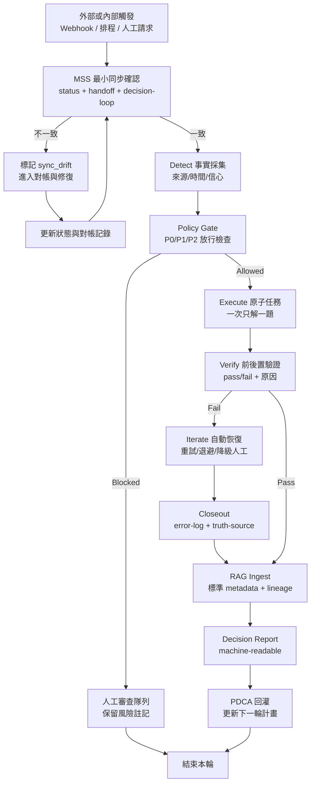
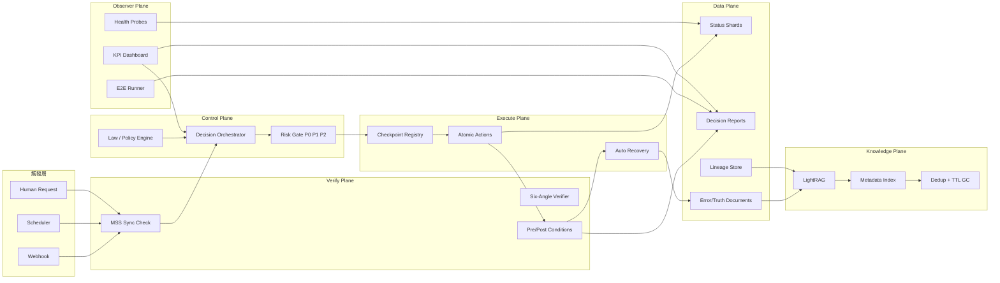

## Plan: 舊架構整合為零信任新專案

新專案不在舊架構上硬改，而是把舊專案拆成「可重用能力」、「需重構能力」、「歷史資產」。核心目標是把現有的 health / decision / truth-xval / status / error-log / truth-source 能力，重組成一個以零信任為核心、可自我偵測、可同步、可驗證、可迭代、可 RAG 調用的新系統。

**Steps**
1. Phase 0：先定義新專案的勝利條件與不做的事
2. 定義新專案使命：不是單純自動化，而是建立可持續進化的外掛大腦。
3. 定義四個硬目標：同步一致、零信任放行、可追溯驗證、核心知識全面 RAG 化。
4. 定義第一波不納入範圍：外部論壇信號、完整 API traces、Instagram 專屬流程、一次性 benchmark 工具。
5. Phase 1：把舊架構拆成資產地圖
6. 直接沿用資產：status store、decision rule engine、truth-xval、health check、law 規則、truth-source 結構、error-log 結構。
7. 重構後沿用資產：state machine、decision-engine、LightRAG adapter、request context、config。
8. 降級為歷史資產：archive 腳本、領域專屬 Instagram 模組、一次性 benchmark、舊部署 shell 腳本。
9. Phase 2：建立新專案的四層架構
10. Control Plane：規則、風險分級、放行門檻、決策記錄。
11. Data Plane：狀態 shards、事件文檔、RAG metadata、lineage trace。
12. Verify Plane：MSS、truth-xval、preconditions、postconditions、故障注入驗證。
13. Execute Plane：原子 action、checkpoint registry、auto-recovery、排程與事件 hook。
14. Phase 3：把舊能力映射到新模組
15. 舊的 status_store.py -> 新的 transactional status store（白話：原本會存狀態，新的版本要保證不會寫一半）。
16. 舊的 decision_rule_engine.py -> 新的 policy engine（白話：保留規則引擎，但加上風險分級與拒絕執行條件）。
17. 舊的 decision-engine.py -> 新的 decision orchestrator（白話：不只給建議，而是先檢查資料夠不夠可信才決定能不能做）。
18. 舊的 state_machine.py -> 新的 checkpoint registry（白話：流程不要散在各腳本，改成統一註冊表）。
19. 舊的 truth-xval.py -> 新的 six-angle verifier（白話：從三真理源升級成六角對帳）。
20. 舊的 health_check.py / e2e_test.py -> 新的 observer suite（白話：全部檢查統一進監控層，結果都落 machine-readable 狀態）。
21. 舊的 truth-source/ + error-log/ + docs/ + decision-loop-last.json -> 新的 knowledge documents（白話：全部變成可檢索、可追來源的知識文件）。
22. Phase 4：先做最小閉環，不先做大全套
23. 先完成 Detect：所有關鍵事件都產生標準化事實，含 source、time、confidence、decision_id。
24. 再完成 Sync：所有狀態更新走同一個原子提交機制，禁止各腳本各自亂寫。
25. 再完成 Verify：每個高風險 action 都有前置與後置驗證。
26. 最後完成 Iterate：失敗後有重試、退避、人工降級與 closeout 回灌。
27. Phase 5：建立零信任放行規則
28. P0 任務：六角驗證全綠才可自動執行。
29. P1 任務：允許部分黃燈，但必須保留風險標記與人工可接手點。
30. P2 任務：可自動執行，但必須仍有 machine-readable 結果。
31. 任務若缺來源、缺驗證、缺同步一致性，直接 blocked，不得執行。
32. Phase 6：建立 RAG 統一知識模型
33. 文檔類型至少包含：error_fix、decision、health_event、session_summary、monitoring_alert、lineage_trace、reference_doc。
34. 每份文檔必帶 metadata：doc_type、origin_path、occurred_at、indexed_at、confidence、validity、tags、lineage。
35. 每份文檔必帶可追溯來源：對應檔案、狀態、決策或事件 ID。
36. ingest 策略分兩種：事件驅動（寫入即入庫）與週期校驗（每日/每週/每月）。
37. Phase 7：把 PDCA 變成系統流程，而不是口號
38. P（Plan）：先做意圖澄清、事實收集、skill 選擇、MSS 對帳。
39. D（Do）：只執行一個原子任務或一條閉環，不多線亂打。
40. C（Check）：用零幻覺工具或子代理做驗證，輸出 pass/fail 與原因。
41. A（Act）：清洗資訊、做 bug closeout、存真理、進 RAG、回灌下一輪計畫。
42. Phase 8：新舊雙軌策略
43. 舊專案繼續作為參考基線與資源池，不再承擔新架構責任。
44. 新專案先鏡像讀舊專案輸出，不直接依賴舊專案內部流程。
45. 只有當新專案連續達標時，才把主控制權切換過來。
46. Phase 9：切換條件
47. MSS 通過率必須達 100%。
48. sync drift 率必須低於 3%。
49. P0 假陽性率必須低於 2%。
50. 核心來源入庫覆蓋率必須高於 95%。
51. 任一決策都必須能追溯到 root fact、rule hit、execution result、closeout record。

**舊架構 -> 新架構映射**
- /Users/ryan/meta-agent/common/status_store.py -> 新專案 status/transaction_store.py：負責原子狀態提交與 shard 鎖。
- /Users/ryan/meta-agent/common/decision_rule_engine.py -> 新專案 control/policy_engine.py：負責規則評估與風險分級。
- /Users/ryan/meta-agent/common/state_machine.py -> 新專案 exec/checkpoint_registry.py：負責統一註冊與執行流程。
- /Users/ryan/meta-agent/scripts/decision-engine.py -> 新專案 control/decision_orchestrator.py：負責 detect -> decide -> dispatch。
- /Users/ryan/meta-agent/scripts/truth-xval.py -> 新專案 verify/six_angle_verifier.py：負責六角交叉驗證。
- /Users/ryan/meta-agent/scripts/health_check.py -> 新專案 observe/health_probes.py：負責依賴健康檢查。
- /Users/ryan/meta-agent/scripts/e2e_test.py -> 新專案 verify/e2e_runner.py：負責閉環驗證。
- /Users/ryan/meta-agent/law.json -> 新專案 policy/law.json：負責硬規則、門檻與禁區。
- /Users/ryan/meta-agent/error-log/ -> 新專案 knowledge/error_fix/：故障與修復知識。
- /Users/ryan/meta-agent/truth-source/ -> 新專案 knowledge/decisions/：決策與驗證真理。
- /Users/ryan/meta-agent/memory/status/ -> 新專案 runtime/status/：運行狀態來源。
- /Users/ryan/meta-agent/memory/decision-loop-last.json -> 新專案 runtime/decision_reports/：決策迭代報告。
- /Users/ryan/meta-agent/docs/ + /Users/ryan/meta-agent/memory/master-plan.md -> 新專案 knowledge/reference/：規劃與架構知識。

**白話版架構說明**
- Control Plane：決定能不能做。白話：像總控台，先看規則與風險，不合格就擋下來。
- Data Plane：保存真相。白話：所有狀態、錯誤、決策、驗證結果都放這裡，不能各寫各的。
- Verify Plane：確認是不是真的成功。白話：不是說修好了就算，要真的檢查過。
- Execute Plane：真正去做事。白話：修 bug、重試、同步、寫回狀態都在這層。

**客觀指標**
1. MSS 通過率：目標 100%。
2. Sync drift 率：目標 < 3%。
3. P0 假陽性率：目標 < 2%。
4. 自動恢復成功率：目標 >= 95%。
5. P0 MTTR：目標 <= 15 分鐘。
6. 核心來源入庫覆蓋率：目標 >= 95%。
7. Metadata 完整率：目標 >= 98%。
8. 檢索可溯源率：目標 100%。
9. 意圖確認回合數：P0 <= 2，P1/P2 <= 3。
10. 驗證設計覆蓋率：目標 100%。
11. CAPA 關閉率：目標 >= 90%。
12. 回歸外洩率：目標 < 5%。
13. 失敗閉環完成率：失敗事件中有完整後續行動（修復、驗證、沉澱、回灌）的比例，目標 100%。
14. 失敗趨勢斜率（7 日）：每 7 日同類失敗事件數的變化斜率，目標 < 0（持續下降）。
15. 重複失敗抑制率：同根因 14 天內再次發生但已被預防機制攔截的比例，目標 >= 80%。

**細部規則**
1. 沒有來源鏈，不准做。
2. 沒有 pass/fail 驗證，不准做。
3. 三份核心狀態不同步，先修同步，不准擴功能。
4. 所有執行都必須有 decision_id 與 machine-readable 記錄。
5. 失敗任務 24 小時內必須完成 closeout、真理沉澱與 RAG 入庫。
6. 若 metadata 不完整或結果不可追溯，該知識不得進入高風險決策。
7. 每輪只解一題，驗證過再換下一題。
8. 每個失敗事件必須建立「下一步行動」並指派 owner、deadline、驗證條件；缺一不可。
9. 若同類失敗在 7 日內不下降，必須升級為系統性問題（Systemic Incident）並暫停相關功能擴展。
10. 關閉失敗事件前，必須完成二次驗證（立即驗證 + 延遲回歸驗證），防止假修復。

**建議技術棧**
- 語言：Python 3.11+。
- API：FastAPI（若需要對外服務）。
- 狀態：JSON shards + file lock；若後續擴展再引入 SQLite/Postgres。
- 驗證：pytest + 腳本化 probes + e2e runner。
- 排程：launchd（本機）或 cron；後續可抽換成工作佇列。
- 知識庫：LightRAG 作為第一版；metadata 可先 JSON/SQLite，後續再拆。
- 去重：先字串相似，第二階段導入語義 embedding。
- 觀測：統一輸出 machine-readable JSON 報告與週報。

**Relevant files**
- /Users/ryan/meta-agent/common/status_store.py — 舊狀態儲存核心。
- /Users/ryan/meta-agent/common/decision_rule_engine.py — 舊規則引擎核心。
- /Users/ryan/meta-agent/common/state_machine.py — 舊流程骨架。
- /Users/ryan/meta-agent/scripts/decision-engine.py — 舊決策循環核心。
- /Users/ryan/meta-agent/scripts/truth-xval.py — 舊真理驗證核心。
- /Users/ryan/meta-agent/scripts/health_check.py — 舊觀測核心。
- /Users/ryan/meta-agent/law.json — 舊規則真理源。
- /Users/ryan/meta-agent/error-log/2026-03-18-mobile-bridge-api-down.md — 故障文檔樣本。
- /Users/ryan/meta-agent/truth-source/2026-03-16-auto-git-score.md — 決策文檔樣本。
- /Users/ryan/meta-agent/memory/status/health_check.json — 狀態文檔樣本。
- /Users/ryan/meta-agent/memory/decision-loop-last.json — 決策報告樣本。
- /Users/ryan/meta-agent/docs/project-execution-flow.md — 現行流程基線。

**Verification**
1. 新專案能從舊專案輸出中成功建立標準化文檔與 lineage。
2. 新專案能獨立跑完 detect-sync-verify-iterate 最小閉環。
3. P0 任務在六角未全綠時會被阻擋。
4. 任一查詢結果都能回到原始來源檔與決策 ID。
5. 新舊雙軌對照兩週後，P0 檢出與修復成功率不低於舊系統。

**Decisions**
- 採新專案重建，不在舊專案上硬改。
- 舊專案定位為資源池、回歸基線、歷史知識來源。
- 第一波先做最小閉環與核心 RAG，不追求一次做完全部能力。
- 先求勝而後戰：先把同步、驗證、追溯條件做滿，再擴功能。

**Further Considerations**
1. 新 repo 的資料夾命名是否固定為 control/data/verify/exec/knowledge/runtime 六層，方便你之後檢查責任邊界。
2. 是否在第一週就建立 KPI 週報格式，避免後面有系統沒指標。
3. 是否把「skill 觸發判斷」也獨立成 policy 模組，讓不同場景可以自動選工具與流程。

## 觸發到反饋程序圖（End-to-End）



白話：先對帳再開工，沒過門檻就不做；做完一定驗證；失敗一定沉澱成知識再回到下一輪計畫。

## 新專案架構圖（Zero-Trust + RAG）



白話：控制層決定可不可以做，驗證層確認可不可信，執行層只做通過門檻的事，資料與知識層把所有結果沉澱成可查可追的記憶。

## 專案在 AI 界的定位與客觀評價

### 定位（Positioning）

這個專案不是一般聊天機器人，也不是單純工作流自動化工具。它更接近：

1. AI Reliability Orchestrator（AI 可靠性協調器）
2. Agentic Memory Ops Platform（Agent 記憶運維平台）
3. Zero-Trust Decision Loop for AI（零信任決策閉環系統）

白話：它的核心價值是「降低 AI 的失憶、誤判、不可追溯」，讓 AI 工作像工程系統，而不是像臨場 improvisation。

### 客觀評價（Baseline vs Target）

說明：

1. Baseline = 舊架構現況分數（2026-03）。
2. Target = 新計劃落地後的目標分數（8 週）。
3. Gap = 目前距離目標還差多少。

評分區間 1-10（10 為最佳）：

| 能力面向 | Baseline（舊架構） | Target（新計劃） | Gap |
|---|---:|---:|---:|
| 可追溯性 | 8.5 | 9.5 | 1.0 |
| 同步一致性 | 6.5 | 9.0 | 2.5 |
| 零信任落地度 | 6.0 | 9.0 | 3.0 |
| 自動恢復成熟度 | 7.0 | 9.0 | 2.0 |
| RAG 可用性 | 7.5 | 9.2 | 1.7 |
| 工程化可維運性 | 7.0 | 9.0 | 2.0 |

白話解讀：

1. 舊架構最強項是可追溯性（已經有資料基礎）。
2. 最大短板是同步一致性與零信任落地（這兩項是新計劃優先修的核心）。
3. 新計劃不是從 0 到 1，而是從 7 分系統往 9 分可靠性平台升級。

綜合評分：

1. Baseline：7.1/10（中高潛力、尚未 fully productized）。
2. Target：9.1/10（可對標商業級可靠性與可追溯能力）。

### 同級產品比較（客觀）

1. 相較一般 Agent 專案：你在「可追溯 + 可驗證」明顯領先。
2. 相較成熟 AIOps 平台：你在「標準化治理 + 操作自動化深度」仍有距離。
3. 最有競爭力的方向：AI 記憶可靠性與決策可驗證基礎設施。

### 下一步客觀里程碑

1. 把 sync drift 壓到 < 1%。
2. 把 P0 假陽性率壓到 < 1%。
3. 把檢索可溯源率維持 100% 並達成 14 天無 P0 漏檢。

白話：只要做到這三點，你就從「有潛力的工程原型」進入「可對標商業級可靠性系統」。

## 工程版程序圖（含門檻、SLA、重試與KPI）

```mermaid
flowchart TD
	T[Trigger\nWebhook / Scheduler / Human] --> S0[MSS Sync Check\nstatus+handoff+decision-loop]

	S0 -->|fail| S0F[Create sync_drift incident\nSLA: P0 <= 10m]
	S0F --> S0R[Reconcile status\nwrite machine-readable report]
	S0R --> S0

	S0 -->|pass| D1[Detect Facts\nsource,timestamp,confidence,hash]
	D1 --> D2[Freshness Gate\nhealth<=15m, smoke<=30m]
	D2 -->|stale| D2F[Mark input_stale\nblock high-risk actions]
	D2F --> PR1[State: pending_refresh\ncreate refresh_ticket]
	PR1 --> PR2[Refresh facts\nretry with backoff]
	PR2 -->|refresh_ok| D1
	PR2 -->|refresh_fail_over_limit| PMQ[State: pending_manual_action\nopen manual_action_ticket]

	D2 -->|fresh| P1[Policy Gate\nP0/P1/P2]
	P1 -->|P0 and six-angle not all green| P1B[Blocked\nmanual review required]
	P1B --> PMQ

	P1 -->|allowed| X1[Execute Atomic Action\ncheckpoint registry]
	X1 --> V1[Pre/Post Verification\npass/fail + reason]

	V1 -->|pass| K1[RAG Ingest\ndoc+metadata+lineage]
	V1 -->|fail| R1[Auto-Recovery Loop]

	R1 --> R2{retry_count < max_retry?}
	R2 -->|yes| R3[Backoff\n1m -> 3m -> 5m]
	R3 --> X1
	R2 -->|no| R4[Degrade to manual\nopen CAPA item]
	R4 --> PMQ
	PMQ --> MH1[Manual action submit\nowner + deadline + acceptance criteria]
	MH1 --> V1
	V1 -->|manual_fail| C1[Bug Closeout\nerror-log + truth-source]
	V1 -->|manual_pass| K1
	C1 --> K1

	K1 --> Q1[Quality Gates\nmetadata>=98%\ntraceability=100%]
	Q1 -->|fail| Q1F[Reject high-risk usage\nknowledge not trusted]
	Q1F --> CAPA[Open CAPA + systemic check\npause related feature expansion]
	CAPA --> PDCA
	Q1 -->|pass| REP[Decision Report\nwith decision_id]

	REP --> KPI[KPI Update\nMSS, drift, MTTR, false-positive, coverage]
	KPI --> PDCA[PDCA Feedback\nupdate next Plan]
	PDCA --> GAP[狀態檢查與距離核心使命評估\nStatus Check & Mission Gap Assessment\n(agent/mcp/skill/json rule)]
	GAP --> JUDGE[收斂判斷\nConvergence Decision\n(gap>0: continue, gap=0: closeout)]
	JUDGE -->|gap>0| T[re-enter trigger loop]
	JUDGE -->|gap=0| CLOSE[結案 Closeout]
```

白話：這版是「真閉環」流程，沒有失敗後直接結束的死路；所有 fail 都會進 pending 狀態，帶著 ticket、SLA、驗證條件回流，直到關閉或升級系統性事件。每一輪結束前都會自動檢查現狀與距離核心使命的 gap，客觀評估後決定是否繼續收斂，直到 gap=0 才真正結案。
